# CSS-Gallery

1. 웹사이트 제작에 필요한 CSS 작성
2. 모든 CSS는 Pull requests를 통하여 작성하였기 때문에 참고 가능

## 리엑트화 작업 일지

### 2022-05-29

메인 페이지에서 이미지를 클릭할 경우 해당 css를 직접 테스트 해볼 수 있는 곳으로 이동하는 작업을 하였음
Parms로 id에 맞는 js 파일을 불러오고 싶었으나 방법을 찾지못함.
json에 있는 id와 별개로 있는 js 파일은 서로 연관성이 없어서 불러올 수 없다고 생각함

### 2022-05-30

App.js에서 css가 통합되어 css 선택자 중복이 이어지므로
css 선택자에 부모요소를 지속적으로 입력하는 모습을 발견하여
Google I/O 에서 발표한 css Scope 기능을 사용해보았으나 적용이 안되는 것을 확인하고 부모요소를 하나씩 입력해주는 방식으로 진행중..

html을 작성하지않고 바로 JSX로 작성하여 css를 추가 작성

### 2022-05-31

기존 html css를 사용할때

```
class:hover:before{}
```

해당 형식으로 css 작동을 하였으나 jsx로 html을 구성하고 import로 css를 가져오니
해당 문법이 적용이 안되는 것을 확인하였음
지속적으로 해당 방법을 실패하고 styled components 를 사용하는 방법을 알게되어
styled components로

```
&:hover:before{}
```

을 사용하였으나 마찬가지로 실패 하였음, 대신 css파일을 추가로 작성하지 않고
styled-components로 작업하여 js 파일 하나로 프로젝트 제작 중

### 2022-06-01

html 파일 자체를 만들지 않으면서 Interaction Nav 작업
이전에는 html, css 파일로 갤러리를 만들었기 때문에 코드 자동완성이 되었는데
styled-components로 작업하다보니 자동완성이 안뜨는 상황
vscode styled-components 확장프로그램 설치하여 문제해결

aspect-ratio 화면 비율 조절 속성

https://developer.mozilla.org/en-US/docs/Web/CSS/aspect-ratio
참고

### 2022-06-02

React 파일을 배포

처음에는 github.io로 쉽게 배보해보려고했지만
CSS_Effect 폴더 내부에 Css_gallery가 있어서 문제가 잇었음
css_gallery를 따로 레포지토리에 올리는 방식을 취하고
github.io에 올려봤으나 router 에러가 지속적으로 발생하였고
이에대한 해결방법으로 vercel에 배포

정상적으로 배포

### 2022-06-03

main에 import와 router가 과도하게 몰리고있는 상황
Effect, 3D, Nav, Button 별 import 해올 수 있는 js를 작성하기
html, css로 바로 렌더링되는 화면을 볼 수 없어 매번 테스트 코드를 작성해야하므로
테스트를 간소화할 수 있게 코드 정리

### 2022-06-04

js 파일 4개로 router 파일들을 분리완료
테스트 코드를 미리볼 수 있는 탭 생성 (3d css container 위치)

페이지 렌더링 되는 부분도 분리하고 싶은데
1차 시도는 각 렌더링 파일마다 json을 새롭게 호출하고있으므로
이후 Redux를 사용하여 Redux 에서만 json 데이터를 가져오고
각 js파일에서 상태관리를 해보려고함

### 2022-06-06

styled components 내부에서는 그냥 url + 링크를 이용하면 안되는 현상
img 태그 내에서 style={{}} 을 사용해도 안되는 현상
2가지 문제가 있어서 3D Card 효과의 이미지가 정상적으로 출력되지 않았고
해당 문제를 해결하기위해 이미지 자체를 import 해온 뒤
styled components img 부분 url(${})로 해결

### 2022-06-09

새롭게 작성한 basket ball CSS를 styled components를 최대한 활용해보는 방법으로
각 컴포넌트 별 작성을 하여 class Name을 제외해보았고
애니메이션을 @keyframes 로 작성하는 것이 아닌 styled components keyframes을 사용하는 방식으로
제작을 해보았음

### 2022-06-10

툴팁을 제작하며 styled-components 사용방법에 점점 익숙해지는 중
다양한 선택자를 사용해보고 있음

### 2022-07-05

몇몇 회사의 면접과 기술과제를 진행하느라 해당 프로젝트 진행이 더딘상황...
노마드 리엑트 챌린지와 타입스크립트 챌린지도 정신없는 상황
빠르게 하나씩 마무리도 하고 취업도 되었으면 좋겠다.
마음편히 해당 프로젝트 진행하고 싶다.

## 1. OverlappingImage

- 작성일자 : 2022-04-26
- PR Link : https://github.com/eovhdnjawm1/CSS-Gallery/pull/1
- Colum
  
- Low
  

## 2. ButtonFilter

- 작성일자 : 2022-04-26
- PR Link : https://github.com/eovhdnjawm1/CSS-Gallery/pull/2
  

## 3. VideoText

- 작성일자 : 2022-04-27
- PR Link : https://github.com/eovhdnjawm1/CSS-Gallery/pull/3
  

## 4. Loading Bar

- 작성일자 : 2022-04-28
- PR Link : https://github.com/eovhdnjawm1/CSS-Gallery/pull/4
- background-color none
  
- background-color
  
- keyframes Change ver.
  

## 5. Link Hover Animation

- 작성일자 : 2022-04-29
- PR Link : https://github.com/eovhdnjawm1/CSS-Gallery/pull/5
  

## 6. Image Color Up

- 작성일자 : 2022-04-29
- PR Link : https://github.com/eovhdnjawm1/CSS-Gallery/pull/6
  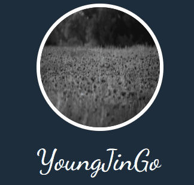

## 7. 3D Card Animation

- 작성일자 : 2022-04-30
- PR Link : https://github.com/eovhdnjawm1/CSS-Gallery/pull/7
  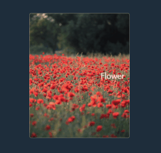

## 8. 3D Flip Card Animation

- 작성일자 : 2022-05-01
- PR Link : https://github.com/eovhdnjawm1/CSS-Gallery/pull/8
  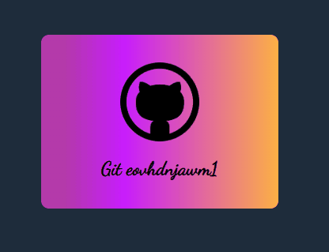

## 9. Nav Menus

- 작성일자 : 2022-05-02
- PR Link : https://github.com/eovhdnjawm1/CSS-Gallery/pull/9
  

## 10. Change Figure

- 작성일자 : 2022-05-03
- PR Link : https://github.com/eovhdnjawm1/CSS-Gallery/pull/10
  

## 11. Hover Card Ani

- 작성일자 : 2022-05-04
- PR Link : https://github.com/eovhdnjawm1/CSS-Gallery/pull/11
  

## 12. Skew Button Animation

- 작성일자 : 2022-05-05
- PR Link : https://github.com/eovhdnjawm1/CSS-Gallery/pull/12
  

## 13. Hover Effect

- 작성일자 : 2022-05-06
- PR Link : https://github.com/eovhdnjawm1/CSS-Gallery/pull/13
  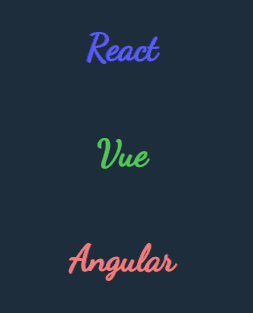

## 14. Button Hover Animation

- 작성일자 : 2022-05-07
- PR Link : https://github.com/eovhdnjawm1/CSS-Gallery/pull/14
  

## 15. Gradient Box

- 작성일자 : 2022-05-08
- PR Link : https://github.com/eovhdnjawm1/CSS-Gallery/pull/15
  

## 16. Change Menu Button Animation

- 작성일자 : 2022-05-09
- PR Link : https://github.com/eovhdnjawm1/CSS-Gallery/pull/16
  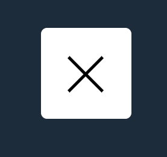

## 17. Neon Sign

- 작성일자 : 2022-05-10
- PR Link : https://github.com/eovhdnjawm1/CSS-Gallery/pull/17
  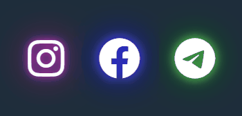

## 18. NeonMovingButton

- 작성일자 : 2022-05-14
- PR Link : https://github.com/eovhdnjawm1/CSS-Gallery/pull/18
  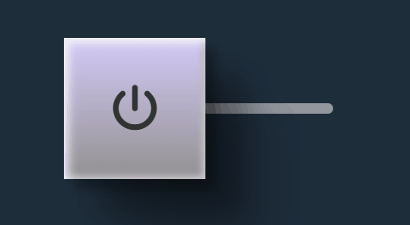

## 19. Pulse Animation

- 작성일자 : 2022-05-15
- PR Link : https://github.com/eovhdnjawm1/CSS-Gallery/pull/19


## 20. Text Effect

- 작성일자 : 2022-05-18
- PR Link : https://github.com/eovhdnjawm1/CSS-Gallery/pull/20
  

## 21. Text Effect

- 작성일자 : 2022-05-20
- PR Link : https://github.com/eovhdnjawm1/CSS-Gallery/pull/21
  

## 22. Focus Blur Event

- 작성일자 : 2022-05-23
- PR Link : https://github.com/eovhdnjawm1/CSS-Gallery/pull/22
  

## 23. Focus Blur Event

- 작성일자 : 2022-05-23
- PR Link : https://github.com/eovhdnjawm1/CSS-Gallery/pull/23
  

## 24. Focus NavBar

- 작성일자 : 2022-05-25
- PR Link : https://github.com/eovhdnjawm1/CSS-Gallery/pull/24
  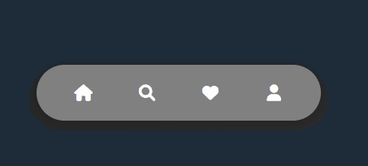

## 25. Shadow Button

- 작성일자 : 2022-05-26
- PR Link : https://github.com/eovhdnjawm1/CSS-Gallery/pull/25
  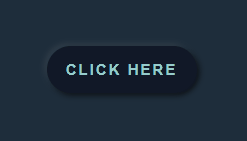

## 26. Neon Loading

- 작성일자 : 2022-05-27
- PR Link : https://github.com/eovhdnjawm1/CSS-Gallery/pull/26
  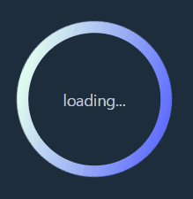

## 27. Bounce Loading

- 작성일자 : 2022-05-30
- PR Link : https://github.com/eovhdnjawm1/CSS-Gallery/pull/27
  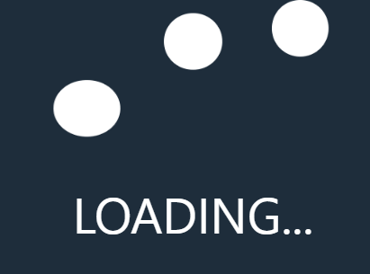

## 28. InteractionNavBar

- 작성일자 : 2022-06-01
- PR Link : https://github.com/eovhdnjawm1/CSS-Gallery/pull/28
  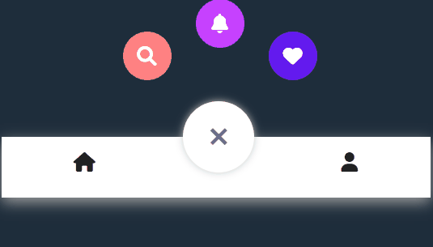

## 29. ClockIcon

- 작성일자 : 2022-06-02
- PR Link : https://github.com/eovhdnjawm1/CSS-Gallery-Project/pull/1
  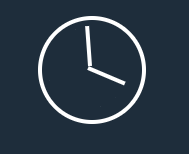

## 30. InputAnimation

- 작성일자 : 2022-06-03
- PR Link : https://github.com/eovhdnjawm1/CSS-Gallery-Project/pull/2
  

## 31. EffectSolar

- 작성일자 : 2022-06-04
- PR Link : https://github.com/eovhdnjawm1/CSS-Gallery-Project/pull/3
  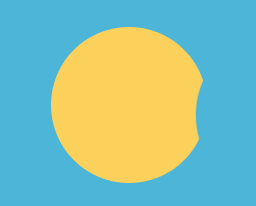

## 32. Vertical loading bar

- 작성일자 : 2022-06-05
- PR Link : https://github.com/eovhdnjawm1/CSS-Gallery-Project/pull/4
  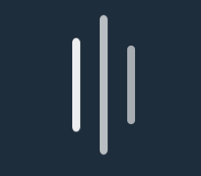

## 33. 3D Rotate Card

- 작성일자 : 2022-06-06
- PR Link : https://github.com/eovhdnjawm1/CSS-Gallery-Project/pull/5
  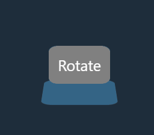

## 34. Rollup Content

- 작성일자 : 2022-06-07
- PR Link : https://github.com/eovhdnjawm1/CSS-Gallery-Project/pull/6
  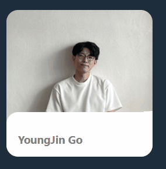

## 35. Basket Ball

- 작성일자 : 2022-06-09
- PR Link : https://github.com/eovhdnjawm1/CSS-Gallery-Project/pull/7
  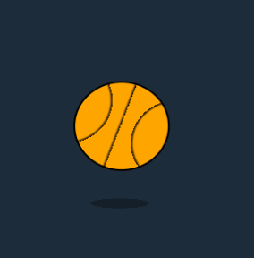

## 36. Tool Tip

- 작성일자 : 2022-06-10
- PR Link : https://github.com/eovhdnjawm1/CSS-Gallery-Project/pull/8
  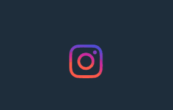

## 37. ImageDetails

- 작성일자 : 2022-06-12
- PR Link : https://github.com/eovhdnjawm1/CSS-Gallery-Project/pull/9
  

## 38. ButtonInteraction

- 작성일자 : 2022-06-17
- PR Link : https://github.com/eovhdnjawm1/CSS-Gallery-Project/pull/10
  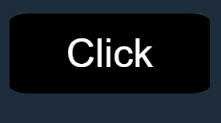

## 39. ButtonInteraction

- 작성일자 : 2022-07-05
- PR Link : https://github.com/eovhdnjawm1/CSS-Gallery-Project/pull/11
  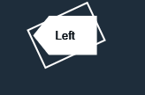

## 40. 3D Bird

- 작성일자 : 2022-07-13
- PR Link : https://github.com/eovhdnjawm1/CSS-Gallery-Project/pull/12
  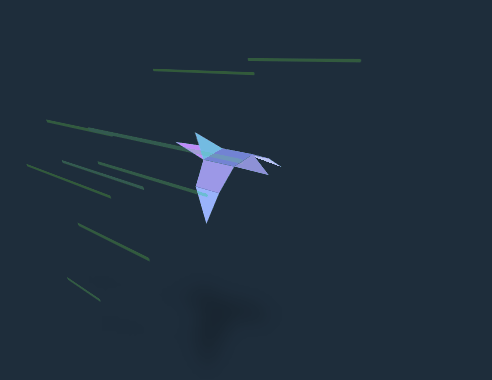

## 41. BulletButton

- 작성일자 : 2022-07-27
- PR Link : https://github.com/eovhdnjawm1/CSS-Gallery-Project/pull/13
  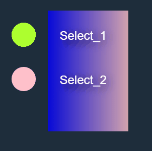
